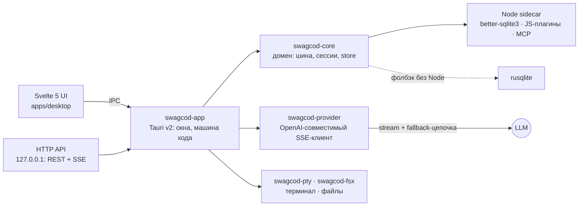

<div align="center">

# ◆ SwagCod

**Десктопный код-агент: Rust-ядро, Tauri v2, Svelte 5. Всё локально, всё твоё.**

Модель читает, пишет и запускает код по твоей задаче: инструменты с подтверждениями,
MCP-серверы, JS-плагины, суб-агенты, семантический поиск, фоновые задачи,
loopback REST API и дашборд телеметрии — в нативном окне с холодным стартом **68 мс**.

[](https://github.com/Swwag666/SwagCode/actions/workflows/ci.yml)


-orange)


</div>

---

## Что умеет

| | |
|---|---|
| 💬 **Живой стрим** | Инкрементальный markdown с подсветкой, reasoning-поток, курсор стрима, токены и ток/с, очередь реплик, стоп-кнопка |
| 🔀 **Провайдеры** | 12 пресетов (OpenAI, Anthropic, Kimi, DeepSeek, OpenRouter, Zen, Gemini, Groq, Mistral, xAI, Ollama, LM Studio) + custom со своим endpoint; нативный клиент Anthropic `/v1/messages`; ключи под DPAPI, наружу только `has_key`; Fetch models с превью и явным сохранением |
| 🛠 **Инструменты** | Файлы (read/write/edit), поиск (grep/glob), bash/pwsh через песочницу, fetch_url — всё с журналированием и подтверждениями |
| 🔌 **MCP** | Внешние инструменты по Model Context Protocol (stdio): реестр серверов, статусы, общий список тулов с встроенными |
| 🧩 **JS-плагины** | `plugins/*.js` в изолированном vm-контексте sidecar'а: дедлайн, read-only prefs, `swagcod.define({name, handler})` |
| 🤖 **Суб-агенты** | Инструмент `subagent` — изолированная ветка хода: только безопасные тулы, своя дешёвая модель (аргумент `model`), бюджет токенов и раундов, отчёт родителю, дерево ходов в UI |
| 🔎 **Семантический поиск** | Embeddings-индекс воркспейса (облако или локальный лексический фолбэк), кэш в отдельной базе, периодическая переиндексация |
| 📋 **Фоновые задачи** | Очередь в SQLite, воркер с экспоненциальным backoff (30 с → 30 мин, до 5 попыток), периодические задачи, восстановление сирот после краша |
| 🌐 **HTTP API** | Loopback REST + SSE рядом с шиной: те же команды, что IPC. Bearer-токен под DPAPI, по умолчанию выключен |
| 📈 **Телеметрия** | Таблица `metrics`, сэмпл раз в минуту, латентность провайдера на первый токен стрима; дашборд: токены/день, латентность, лаги шины |
| 📥 **Импорт из DSH** | Перенос истории DSH Desktop (`session.v3.jsonl.zstd`) — идемпотентно, отдельным соединением, догрузка оборванных сессий, конфиги MCP/плагинов; запуск кнопкой в настройках |
| 🖥 **Терминал** | Настоящий PTY с ANSI-парсером и кольцевым буфером |
| 🔐 **Безопасность** | API-ключ под DPAPI Windows, политики подтверждений (глобальная + per-session), журнал одобрений, песочница путей fsx |
| 🎨 **Внешность** | 4 темы, студия (свой акцент, тонировка, медиафон gif/mp4/webm), масштаб окна 60–200%, свои штриховые SVG-иконки — эмодзи в UI нет |

**Горячие клавиши:** ⌘K ввод · ⌘P палитра команд · ⌘F поиск · ⌘M модель · ⌘B панель · ⌘±/0 масштаб

## Архитектура



| Крейт | Зона | Принцип |
|---|---|---|
| `swagcod-core` | шина событий, сессии, машина хода, контракт Store | **без tauri и без async-рантайма** — headless-тесты и бенчи |
| `swagcod-provider` | OpenAI-совместимый клиент, SSE-парсер, fallback-цепочка B-6 | облако, агрегаторы, Ollama/llama.cpp одним кодом |
| `swagcod-pty` | PTY, ANSI, кольцевой буфер | |
| `swagcod-fsx` | файлы, watch, diff, песочница путей | |
| `swagcod-app` | Tauri-обёртка: окна, IPC, воркеры, HTTP API | тонкий слой над ядром |

Хранилище — better-sqlite3 в Node-sidecar'е (как просил пользователь), аварийный
фолбэк — встроенный rusqlite; контракт `Store` один на оба бэкенда, паритет
покрыт тестами.

## HTTP API (E-7)

По умолчанию **выключен**. Включи портом и перезапусти: `SWAGCOD_HTTP_PORT=47479`
(или prefs-ключ `http_api_port`). Токен (32 байта CSPRNG, хранение под DPAPI)
показывается в Настройки → Безопасность. Слушает только `127.0.0.1`.

| Метод | Маршрут | Что делает |
|---|---|---|
| GET | `/health` | liveness без токена |
| GET | `/v1/diagnostics` | шина, лаги, активные ходы, uptime |
| GET | `/v1/sessions` | список сессий |
| POST | `/v1/turns` | `{session_id, message, model?, temperature?}` → `{turn_id}` |
| POST | `/v1/approvals` | `{call_id, decision: approved\|denied}` |
| GET | `/v1/events` | SSE-поток всех событий шины |

```bash
TOKEN=...   # Настройки → Безопасность → «Копировать токен»
curl -s http://127.0.0.1:47479/v1/diagnostics -H "Authorization: Bearer $TOKEN"
curl -s http://127.0.0.1:47479/v1/turns -H "Authorization: Bearer $TOKEN" \
  -H 'Content-Type: application/json' \
  -d '{"session_id":"s-1","message":"почини тесты"}'
curl -sN http://127.0.0.1:47479/v1/events -H "Authorization: Bearer $TOKEN"
```

## Быстрый старт

Нужны: Rust stable (MSVC), Node 20+, pnpm 11+.

```powershell
cp .env.example .env      # заполни SWAGCOD_API_KEY
pnpm install              # зависимости фронтенда
pnpm --filter swagcod-desktop build          # фронтенд в dist/
cargo build --release -p swagcod-app --features tauri/custom-protocol
# результат: target/release/swagcod-app.exe
```

> ⚠️ Без `--features tauri/custom-protocol` бинарник будет искать localhost:5173
> и покажет ERR_CONNECTION_REFUSED — грабля Tauri v2 (DECISIONS.md §7).

```powershell
cargo test --workspace                       # 290 Rust-тестов
pnpm --filter swagcod-desktop test           # 80 TS-тестов
cargo clippy --workspace --all-targets -- -D warnings
```

## Установка и обновление

**Просто поставить:** скачай `SwagCod-setup.exe` из
[Releases](https://github.com/Swwag666/SwagCode/releases) и запусти —
установка под текущего пользователя (без админа), ярлык в меню Пуск,
WebView2 докачается сам, node-рантайм и sidecar уже внутри установщика.

**Автообновление:** приложение читает манифест `latest.json` из GitHub
Releases (`releases/latest/download/latest.json`), сверяет версию и
подпись minisign, качает новый setup и ставит его. Ручной запуск:
Настройки → General → «Обновления» → «Проверить»; прогресс загрузки
честный, в конце — «Перезапустить сейчас». Неподписанный или чужой
манифест отвергается: подпись обязательна.

**Сборка релиза (для сопровождающих):**

```powershell
# ключ подписи — один раз (генерится в профиль пользователя, вне репы):
npx tauri signer generate -w $env:USERPROFILE\.swagcod-updater\swagcod-updater.key
# релиз локально: setup.exe + .sig + SwagCod.exe + latest.json в releases/
powershell -NoProfile -ExecutionPolicy Bypass -File tools\build-release.ps1 -Sign -Latest
```

Или CI: запушь тег `vX.Y.Z` — workflow `Release` (tauri-action) сам
соберёт NSIS, подпишет артефакты и опубликует релиз с `latest.json`.
Нужны секреты репозитория `TAURI_SIGNING_PRIVATE_KEY` и
`TAURI_SIGNING_PRIVATE_KEY_PASSWORD` (содержимое
`~/.swagcod-updater/swagcod-updater.key` и `password.txt`).

> ⚠️ Автообновление ходит в репозиторий анонимно: пока репа приватная,
> `releases/latest/download/...` отдаёт 404 и проверка честно показывает
> ошибку. Чтобы обновления долетали до всех, релизы должны быть публичными.

## Конфигурация

Ключ провайдера живёт в `.env` (в `.gitignore`) или под DPAPI Windows
(команда «Зашифровать» в Настройки → Безопасность; приоритет: `.env` → DPAPI).

| Переменная | Смысл |
|---|---|
| `SWAGCOD_API_KEY` · `SWAGCOD_BASE_URL` · `SWAGCOD_MODEL` | провайдер (base по умолчанию `https://rustvy.xyz/v1`) |
| `SWAGCOD_FALLBACKS` | B-6: цепочка резервных точек `url\|key\|model;…` (пустой key = локальный эндпоинт) |
| `SWAGCOD_SUMMARIZER_MODEL` | B-3: модель свёртки контекста (пусто = модель сессии) |
| `SWAGCOD_STORE` · `SWAGCOD_NODE` · `SWAGCOD_STORE_SIDECAR` | авто/node/sqlite-бэкенд хранилища |
| `SWAGCOD_EMBEDDINGS_MODEL` · `SWAGCOD_EMBEDDINGS_MODE` · `SWAGCOD_SEMANTIC_DB` | E-2: семантический поиск |
| `SWAGCOD_MCP_TIMEOUT_MS` | E-3: таймаут инструмента MCP (дефолт 60000) |
| `SWAGCOD_PLUGINS_DIR` · `SWAGCOD_JS_TIMEOUT_MS` | E-4: каталог и дедлайн JS-плагинов |
| `SWAGCOD_TASKS_POLL_MS` | E-5: период воркера задач (дефолт 15000) |
| `SWAGCOD_SUBAGENT_MAX_ROUNDS` · `SWAGCOD_SUBAGENT_BUDGET_TOKENS` | E-6: лимиты ветки суб-агента |
| `SWAGCOD_HTTP_PORT` | E-7: порт loopback REST API (не задан — выключен) |
| `SWAGCOD_APPEARANCE` · `SWAGCOD_BG_MODE` | оверрайды темы и фона при старте |

Полный шаблон с комментариями — [`.env.example`](.env.example).

## Бюджеты — числа, не ощущения

Прогон `tools/bench-startup.ps1` против свежего release-бинарника (i5-10400F / 16 ГБ,
Windows, ревизия 37); закоммичено в `bench-out/startup.json`:

| Метрика | Цель | Факт |
|---|---|---|
| Холодный старт до окна | < 400 мс | **66.3 мс** медиана |
| Private bytes нашего процесса | < 40 МБ | **12.0 МБ** |
| Private bytes всей семьи | < 200 МБ | вне бюджета: семья WebView2, справочно (D-013) |
| JS-бандл | < 362 000 Б | **356 529 Б** |
| Тесты | все зелёные | **370** (290 Rust + 80 TS) |
| Clippy · svelte-check | 0 · 0/0 | ✅ |

Таблица переписывается только реальным прогоном: числа в README без строки
в `startup.json` — ложь.

## Статус расширений

План [`BACKEND_EXTENSIONS.md`](BACKEND_EXTENSIONS.md) выполнен целиком:

| Этап | Что | Ревизия |
|---|---|---|
| E-1 | Хранилище в Node-sidecar (better-sqlite3) | 25 |
| E-2 | Семантический поиск на embeddings | 26 |
| E-9 | Импорт сессий из DSH Desktop | 29 |
| E-3 | MCP-клиент (stdio) | 30 |
| E-4 | JS-плагины в sidecar (vm, дедлайн) | 31 |
| E-5 | Фоновые задачи + планировщик | 32 |
| E-6 | Суб-агенты и дерево ходов | 33 |
| E-7 | Локальный HTTP API (loopback, DPAPI-токен) | 34 |
| E-8 | Дашборд телеметрии | 35 |

## Структура

```
crates/
  core/       домен: шина событий, сессии, машина хода, Store. БЕЗ tauri.
  provider/   OpenAI-совместимый клиент, SSE-парсер, fallback-цепочка
  pty/        PTY, ANSI, кольцевой буфер
  fsx/        файлы, watch, поиск, diff, песочница путей
  app/        Tauri-обёртка: окна, IPC, воркеры, HTTP API, DPAPI, импорт DSH
apps/desktop/ Svelte 5 фронтенд (runes, без $lib-алиасов)
sidecar/      Node-серверы: store-server.js (better-sqlite3), plugin-server
plugins/      JS-плагины агента (E-4)
tools/        скрипты бенчей и сборки sidecar
bench-out/    startup.json с числами бюджета (в коммите)
```

## Документация

**Весь контекст, решения и приоритеты — в [`DECISIONS.md`](DECISIONS.md).**
Это единственный источник правды по проекту; если решения там нет — оно не
принято. План развития бэкенда — [`BACKEND_PLAN.md`](BACKEND_PLAN.md),
расширения — [`BACKEND_EXTENSIONS.md`](BACKEND_EXTENSIONS.md).

Каждая ревизия — атомарный коммит: тесты → ворота (cargo test, clippy 0,
svelte-check 0/0, vitest, бандл в бюджете) → деплой → бенч → запись
в DECISIONS → push.

## Лицензия

MIT.
